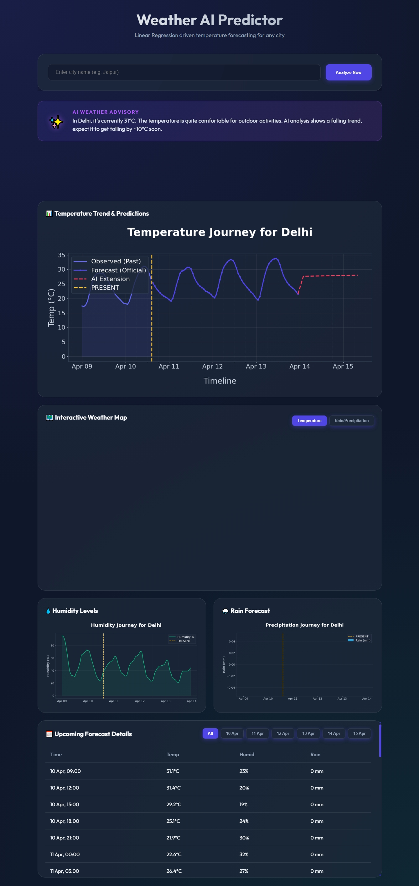
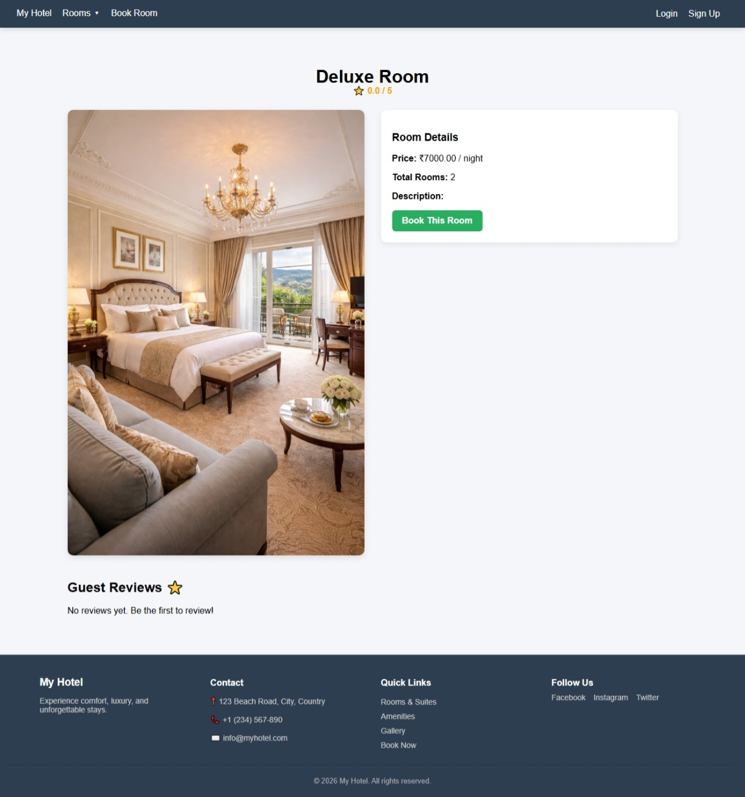
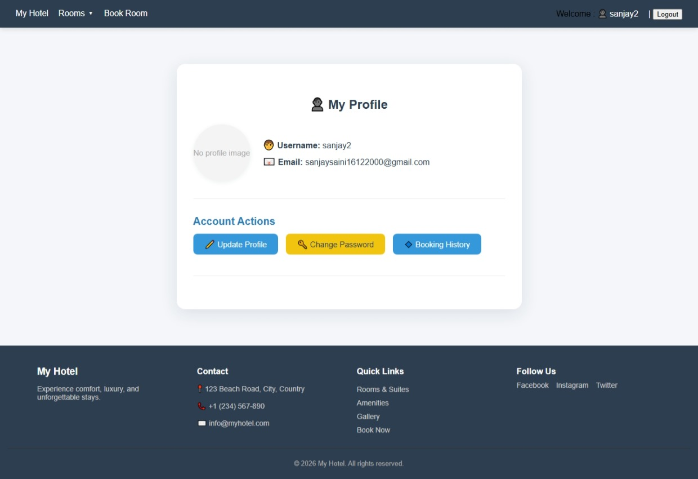
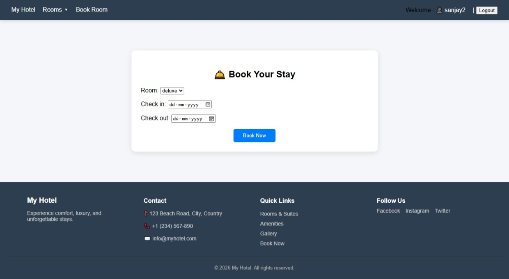
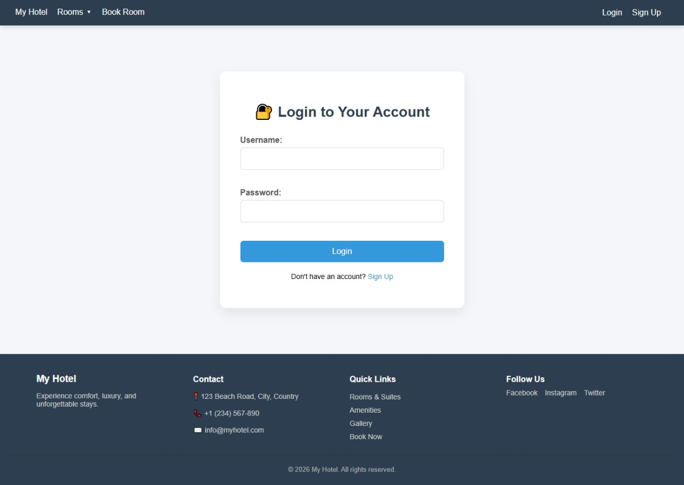

# 🏨 My Hotel - Premium Hotel Management System

[](https://www.djangoproject.com/)
[](https://www.python.org/)
[]()

**My Hotel** is a robust and sophisticated Hotel Management System built with Django. It provides a seamless experience for users to discover hotels, book rooms, and manage their stays, while offering a powerful administrative interface for managing properties, bookings, and customer reviews.

## ✨ Key Features

-   **User Authentication & Profiles**: Secure login, registration, and profile management including profile pictures and password updates.
-   **Hotel & Room Exploration**: Browse various hotels and room types (Single, Double, Deluxe, Suite) with detailed descriptions and high-quality images.
-   **Smart Booking System**: Real-time availability checking based on check-in and check-out dates.
-   **Review & Rating System**: Integrated platform for guests to share their experiences and rate their stays.
-   **Personal Dashboard**: A centralized hub for users to view upcoming bookings and manage their account.
-   **Administrative Power**: Comprehensive dashboard with real-time stats for total revenue, active bookings, and recent payment tracking.
-   **Responsive Design**: A clean, modern UI that works beautifully across mobile, tablet, and desktop devices.

## 🛠️ Technology Stack

-   **Backend**: Django 6.0.1 (Python)
-   **Database**: SQLite (Development) / PostgreSQL (Production ready)
-   **Frontend**: HTML5, Vanilla CSS, JavaScript
-   **Image Processing**: Pillow (for handling hotel and room media)
-   **Authentication**: Django's robust Auth system

## 🚀 Getting Started

Follow these steps to set up the project locally:

### 1. Clone the repository
```bash
git clone https://github.com/sanjaysaini16122000-ui/My_Hotel.git
cd My_Hotel
```

### 2. Set up a Virtual Environment
```bash
python -m venv venv
# On Windows:
venv\Scripts\activate
# On Linux/macOS:
source venv/bin/activate
```

### 3. Install Dependencies
```bash
pip install -r requirements.txt
```

### 4. Run Migrations
```bash
cd hotel
python manage.py migrate
```

### 5. Create a Superuser (Optional - for Admin access)
```bash
python manage.py createsuperuser
```

### 6. Start the Server
```bash
python manage.py runserver
```
Visit `http://127.0.0.1:8000/` in your browser!

## 📂 Project Structure

```bash
My_Hotel/
├── hotel/              # Main Django Project folder
│   ├── accounts/       # User management app
│   ├── bookings/       # Booking logic app
│   ├── hotels/         # Hotel property app
│   ├── rooms/          # Room management app
│   ├── payments/       # Payment integration app
│   ├── reviews/        # User reviews app
│   ├── hotel/          # Project configurations (settings, urls)
│   ├── static/         # Global static assets (CSS, JS, Images)
│   ├── templates/      # Main HTML templates
│   └── manage.py       # Django CLI tool
├── requirements.txt    # Project dependencies
└── README.md           # Project documentation
```

## 📸 Screenshots

To make this project look its best on GitHub, please save the screenshots of your site into the `screenshots/` folder. Here is how they are organized in this documentation:

| Home Page | Room Details |
| :---: | :---: |
|  |  |

| User Profile | Booking Interface |
| :---: | :---: |
|  |  |

| Login Page |
| :---: |
|  |

> [!TIP]
> **Pro-Tip**: High-quality screenshots showing the full flow (from Login to Booking) demonstrate a complete, working application to potential employers!

## 📄 License

This project is licensed under the MIT License - see the [LICENSE](LICENSE) file for details.

---
Developed with ❤️ by [Sanjay Saini](https://github.com/sanjaysaini16122000-ui)
